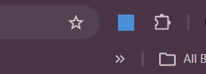
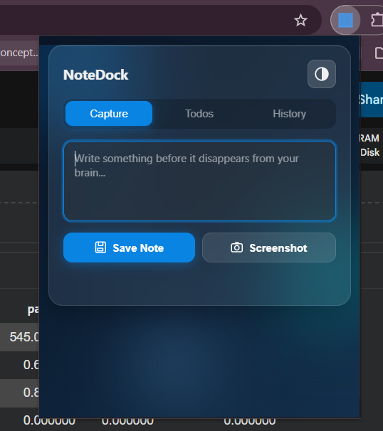
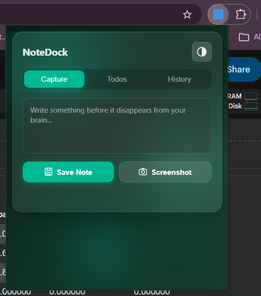
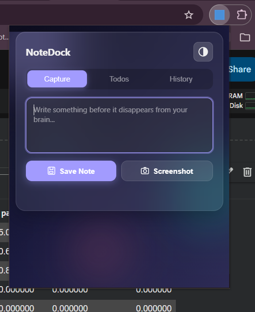
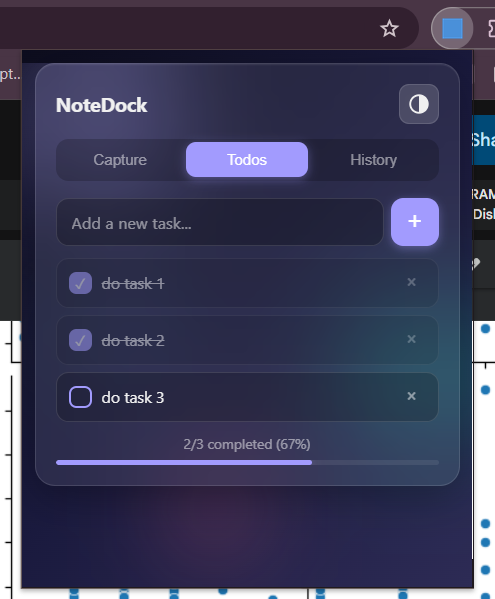
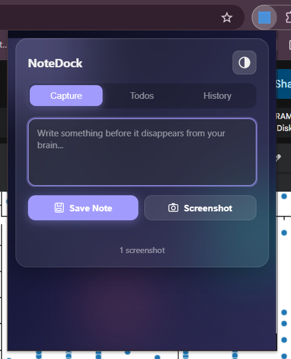

  

<h1 align="center">📝 NoteDock</h1>

  A fast, minimal browser extension for capturing notes, links, and screenshots while you browse.

  
  
  

---

## ✨ Overview

**NoteDock** is designed for frictionless thought capture.  
Instead of opening Notepad, messaging apps, or switching tabs, you can instantly save notes directly from your browser popup.

✔ Write quick notes  
✔ Auto-attach current tab URL  
✔ Capture screenshots  
✔ Everything stored locally

---

## 🚀 Features

- ⚡ Instant popup note-taking
- 🔗 Automatic page link saving
- 📸 One-click screenshot capture
- 🧠 Clean distraction-free interface
- 🔒 No tracking — local storage only

---

## 📸 Preview

  
  

  
  

  

---

## 📂 Project Structure

quick-capture-extension/
│
├── icons/
├── ss/
├── background.js
├── manifest.json
├── popup.html
├── popup.js
├── style.css
├── README.md

---

## 🧩 Installation (Manual Setup)

NoteDock is currently distributed via GitHub.

1. Download or clone this repository.
2. Open Chrome and go to:

chrome://extensions

3. Enable **Developer Mode**.
4. Click **Load unpacked**.
5. Select the `quick-capture-extension` folder.

The extension icon should appear in your toolbar.

---

## 🧠 Usage

1. Visit any webpage.
2. Click the **NoteDock** icon.
3. Type your note.
4. Press **Save** to store it with the page URL.
5. Use **Capture Image** to save a screenshot.

---

## 🔐 Privacy First

- No external servers
- No analytics
- No account required
- All data stored locally via Chrome Storage API

---

## 🛠 Built With

- Manifest V3
- Vanilla JavaScript
- HTML + CSS
- Chrome Tabs & Storage APIs

---

## 📌 Roadmap

- [ ] Notes history viewer
- [ ] Right-click “Save to NoteDock”
- [ ] Export notes as image
- [ ] Dark mode toggle

---

## 🤝 Contributing

Pull requests and improvements are welcome.  
If you have ideas to make NoteDock faster or cleaner, open an issue.

---

## 📄 License

MIT License